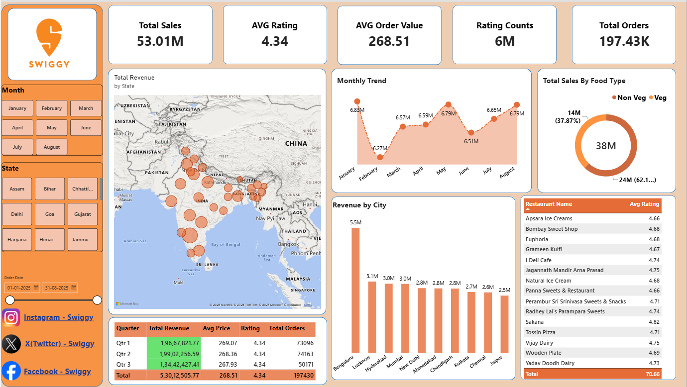

# 🍔 Swiggy Sales & Performance Analysis

[](https://powerbi.microsoft.com/)
[](https://www.python.org/)
[](https://www.mysql.com/)
[](https://www.microsoft.com/excel)

An end-to-end data analytics project examining Swiggy's sales, customer ratings, order trends, food preferences, and geographic performance across Indian states and cities. This project integrates **Python data analysis & visualization**, **Excel data cleaning**, **SQL querying & exploratory analysis**, and an interactive **Power BI Dashboard**.

---

## 📊 Dashboard Overview



---

## 🎯 Key Metrics & Highlights (KPIs)

- **Total Sales / Revenue:** ₹53.01 Million
- **Average Rating:** 4.34 / 5.0
- **Average Order Value (AOV):** ₹268.51
- **Total Customer Ratings:** ~6 Million
- **Total Orders Placed:** 197.43K

---

## 🔍 Key Insights & Visualizations

1. **Geographic Distribution & City Leaders:**
   - **Top City by Revenue:** Bengaluru leads significantly with **₹5.5M**, followed by Lucknow (₹3.1M), Hyderabad (₹3.0M), and Mumbai (₹3.0M).
   - Nationwide geographic mapping across key states including Delhi, Maharashtra, Karnataka, Gujarat, and Tamil Nadu.

2. **Food Type Preference:**
   - **Vegetarian Dishes:** ~62.1% (₹24M) of total food-type sales.
   - **Non-Vegetarian Dishes:** ~37.9% (₹14M) of total food-type sales.

3. **Monthly & Quarterly Trends:**
   - Steady order volume throughout Q1 (~₹19.67M) and Q2 (~₹19.90M).
   - Peak sales observed around May (₹6.79M) and August (₹6.79M).

4. **Top Rated Restaurants:**
   - Highlights elite culinary establishments maintaining 4.6+ average customer ratings, including *Sakana (4.82)*, *Jagannath Mandir Arna Prasad (4.75)*, *Vijay Dairy (4.75)*, and *Radhey Lal's Parampara Sweets (4.74)*.

---

## 🛠️ Tech Stack & Tools

- **Data Cleaning & Preprocessing:** Python (Pandas, NumPy), Microsoft Excel
- **Data Visualization & Analysis:** Python (Matplotlib, Seaborn), Microsoft Power BI (`.pbix`)
- **Database & Querying:** MySQL / SQL (ranking window functions, CTEs, aggregation, group by metrics)
- **Version Control:** Git & GitHub

---

## 🗂️ Project Structure

```text
Swiggy-Sales-Analysis/
├── cleaned dataset/
│   ├── swiggy.xlsx                      # Cleaned primary restaurant & order dataset
│   ├── swiggy_file .xlsx                # Cleaned expanded attributes dataset
│   └── Swiggy Raw Data Excel.xlsx       # Intermediate Excel processing workbook
├── Raw dataset/
│   ├── swiggy_file.csv                  # Raw extracted dataset (CSV)
│   └── swiggy_file.xlsx                 # Raw extracted dataset (Excel)
├── Python/
│   ├── Swiggy_Data_Preprocessing.ipynb  # Data cleaning, EDA & feature engineering
│   └── Swiggy_Data_Visualization.ipynb  # Visual insights & exploratory plotting
├── SQL/
│   ├── swiggy.sql                       # Complete SQL queries: KPIs, window functions, rankings
│   ├── swiggy.csv                       # Database import export CSV
│   └── swiggy_file .csv                 # Additional relational table CSV
├── images/                              # Dashboard UI icons & brand logos
│   ├── logo.png
│   ├── Instagram_icon.png
│   ├── Facebook_Logo_2023.png
│   └── X-Logo-Round-Color.png
├── Swiggy_Analysis.pbix                 # Interactive Power BI report file
├── Swiggy_Dashboard.png                 # Dashboard preview snapshot
├── .gitignore                           # Git ignore rules
└── README.md                            # Project documentation
```

---

## 💻 SQL Analysis Breakdown

The [`SQL/swiggy.sql`](SQL/swiggy.sql) script covers extensive queries including:
- **Aggregations & Overview:** Total restaurants, unique areas, unique cuisines, price & rating ranges.
- **Window Functions & Rankings:**
  - `RANK() OVER (PARTITION BY area ORDER BY avg_ratings)` for top spots per region.
  - Top 3 restaurants in every area using CTEs and `ROW_NUMBER()`.
  - Delivery time correlation with ratings.
- **Filtering & Segmentation:**
  - Vegetarian restaurants maintaining ratings $\ge 4.0$.
  - High-rated budget picks (rating $> 3.5$, price $< ₹300$).
  - Cities segmented by order frequency, average delivery time, and discount offers.

---

## 🚀 How to Explore

1. **Power BI Dashboard:**
   - Clone this repository:
     ```bash
     git clone https://github.com/Adiitya09/Swiggy-Sales-Analysis.git
     ```
   - Open [`Swiggy_Analysis.pbix`](Swiggy_Analysis.pbix) using [Microsoft Power BI Desktop](https://powerbi.microsoft.com/desktop/).
   - Interact with slicers (Month, State, Date range) to filter real-time KPIs.

2. **SQL Scripts:**
   - Import [`SQL/swiggy.sql`](SQL/swiggy.sql) into MySQL Workbench or any SQL client.
   - Run queries against the provided datasets in the [`SQL/`](SQL/) directory.

---

## 👤 Author

- **Aditya Patil** - [GitHub Profile](https://github.com/Adiitya09)